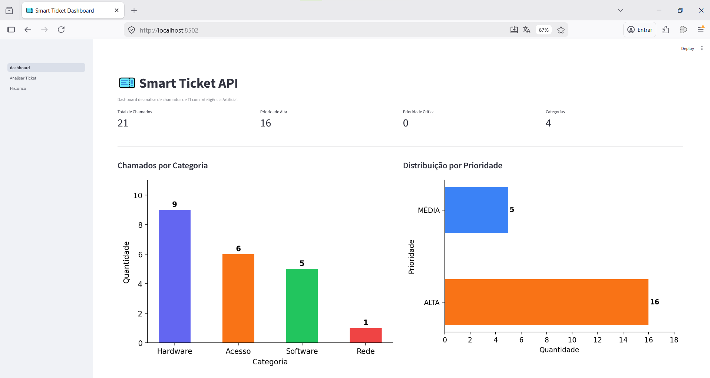
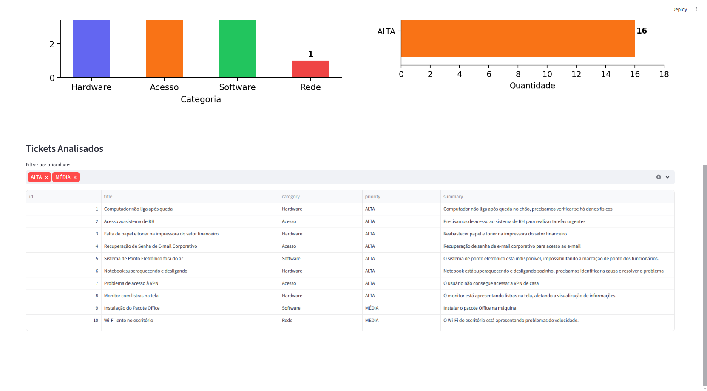
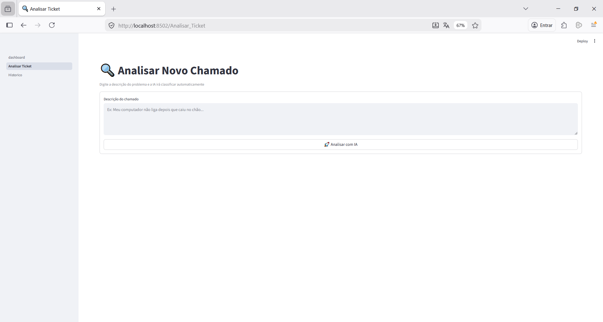
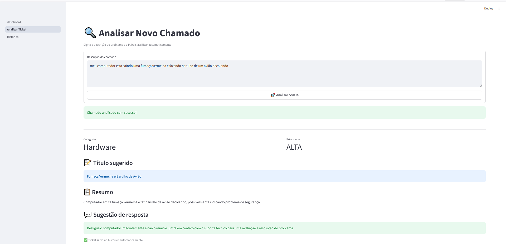
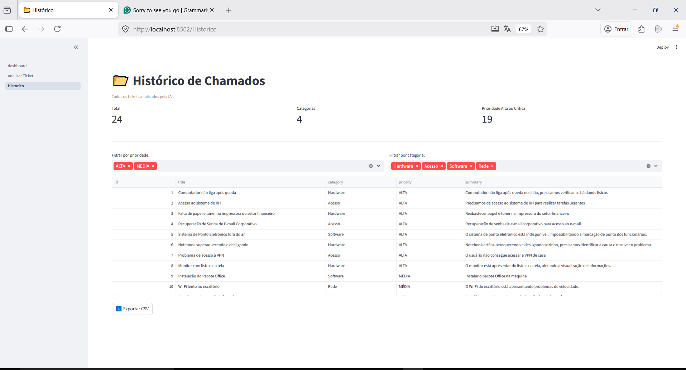
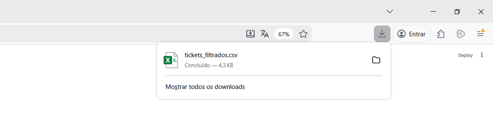

# 🎫 Smart Ticket API

API REST em **Python (FastAPI)** que usa IA (**LLaMA via Groq**) para analisar chamados de suporte de TI em **texto livre** e retornar automaticamente:

- **Categoria**
- **Prioridade**
- **Título**
- **Resumo**
- **Sugestão de resposta inicial**

Inclui também um módulo de **análise de dados + dashboard interativo** com **Streamlit, Pandas e Matplotlib**, com visualização em tempo real, histórico filtrável e exportação — acelerando a triagem e aumentando a consistência do atendimento.

---

## 📋 Sumário

- [Sobre o Projeto](#-sobre-o-projeto)
- [Principais Funcionalidades](#-principais-funcionalidades)
- [Estrutura do Projeto](#-estrutura-do-projeto)
- [Tech Stack](#-tech-stack)
- [Pré-requisitos](#-pré-requisitos)
- [Instalação](#-instalação)
- [Configuração](#-configuração)
- [Como Usar](#-como-usar)
  - [Rodar a API](#rodar-a-api)
  - [Gerar tickets de exemplo (Dashboard principal)](#gerar-tickets-de-exemplo-dashboard-principal)
  - [Rodar o Dashboard](#rodar-o-dashboard)
  - [Swagger / OpenAPI](#swagger--openapi)
- [Dashboard Streamlit](#-dashboard-streamlit)
- [Endpoints](#-endpoints)
- [Exemplo](#-exemplo)
- [Screenshots](#-screenshots)
- [Testes](#-testes)
- [Boas práticas & Segurança](#-boas-práticas--segurança)
- [Autores](#-autores)

---

## 🧠 Sobre o Projeto

Times de suporte de TI frequentemente recebem chamados com descrições vagas e mal categorizadas. Isso faz tickets críticos irem para filas erradas, aumenta retrabalho e compromete SLA.

A **Smart Ticket API** recebe uma descrição em linguagem natural e devolve uma resposta **estruturada**, gerada por um modelo de linguagem, padronizando a triagem e reduzindo o tempo até a primeira resposta.

---

## ✨ Principais Funcionalidades

- **Triagem automática** (categoria, prioridade, título, resumo e resposta sugerida)
- **API REST** com documentação automática (Swagger)
- **Dashboard Streamlit** com:
  - métricas e gráficos
  - análise em tempo real (enviando descrições para a API)
  - histórico com filtros (categoria/prioridade)
  - exportação em CSV
- **Geração em massa** de tickets fictícios para popular a base (`generate_tickets.py`)
- Persistência simples via arquivo CSV (`analysis/tickets_data.csv`)

---

## 📁 Estrutura do Projeto

```text
smart-ticket-api/
│
├── analysis/
│   ├── pages/
│   │   ├── Analisar_Ticket.py   # Página para análise de tickets em tempo real
│   │   └── Historico.py         # Página com histórico e filtros de chamados
│   ├── dashboard.py             # Dashboard principal com métricas e gráficos
│   ├── generate_charts.py       # Script para geração de gráficos estáticos
│   ├── generate_tickets.py      # Script para geração e análise de tickets em massa
│   └── tickets_data.csv         # Base de dados dos chamados analisados
│
├── app/
│   └── main.py                  # API REST com FastAPI e integração com Groq
│
├── assets/                      # Imagens e screenshots do projeto
│
├── test/                        # Testes da aplicação
│
├── .env                         # Variáveis de ambiente (não versionado)
├── .gitignore                   # Arquivos ignorados pelo Git
├── requirements.txt             # Dependências do projeto
└── README.md                    # Documentação do projeto
```

---

## 🧰 Tech Stack

- **Python 3.11+**
- **FastAPI** — API REST
- **Uvicorn** — servidor ASGI
- **httpx** — cliente HTTP assíncrono (dashboard → API)
- **Pydantic** — validação/serialização
- **Groq API** — inferência do modelo
- **Swagger UI** — documentação interativa
- **Streamlit** — dashboard
- **Pandas** — análise/filtragem de dados
- **Matplotlib** — gráficos
- Bibliotecas padrão: `csv`, `os`, `time`

---

## ✅ Pré-requisitos

- **Python 3.11** ou superior
- Conta no Groq Console para obter API Key:  
  [https://console.groq.com](https://console.groq.com)
- **Git** (recomendado)

---

## ⚙️ Instalação

```bash
# Clone o repositório
git clone https://github.com/AnaCarlaG/smart-ticket-api.git
cd smart-ticket-api

# Crie e ative o ambiente virtual
python -m venv venv

# Windows (PowerShell/cmd)
venv\Scripts\activate

# Mac/Linux
source venv/bin/activate

# Instale as dependências
pip install -r requirements.txt
```

---

## 🔐 Configuração

Crie um arquivo **.env** na raiz do projeto:

```env
GROQ_API_URL=https://api.groq.com/openai/v1/chat/completions
GROQ_API_KEY=sua_chave_aqui
GROQ_MODEL=llama-3.1-8b-instant
```

> ⚠️ **Nunca compartilhe sua API Key.**  
> O `.env` não deve ser versionado (mantenha no `.gitignore`).  
> Boa prática: versionar um `.env.example` com os nomes das variáveis (sem valores) para facilitar setup e deploy.

---

## 🚀 Como Usar

### Rodar a API

```bash
uvicorn app.main:app --reload
```

### Gerar tickets de exemplo (Dashboard principal)

```bash
python analysis/generate_tickets.py
```

Esse script envia **20 chamados fictícios** para a API, analisa cada um e salva os resultados em:

```text
analysis/tickets_data.csv
```

> Importante: o **Dashboard principal** (`analysis/dashboard.py`) lê o arquivo `analysis/tickets_data.csv`.  
> Se o CSV ainda não existir, o dashboard principal pode falhar com **FileNotFoundError**.  
> Por isso, gere os tickets antes de abrir o dashboard (ou garanta que o CSV já foi criado por outra execução do seu fluxo).

### Rodar o Dashboard

```bash
streamlit run analysis/dashboard.py
```

Se o comando `streamlit` não for reconhecido no seu terminal (comum no Windows), tente:

```bash
python -m streamlit run analysis/dashboard.py
```

### Swagger / OpenAPI

A documentação interativa fica em:

- [http://localhost:8000/docs](http://localhost:8000/docs)

---

## 📊 Dashboard Streamlit

Após executar `streamlit run analysis/dashboard.py`, o dashboard abre no navegador com páginas acessíveis pelo menu lateral:

| Página | URL | Descrição |
|------:|-----|-----------|
| Dashboard | [http://localhost:8502](http://localhost:8502) | Visão geral com métricas e gráficos |
| Analisar Ticket | [http://localhost:8502/Analisar_Ticket](http://localhost:8502/Analisar_Ticket) | Análise em tempo real via IA; salva no histórico |
| Histórico | [http://localhost:8502/Historico](http://localhost:8502/Historico) | Lista com filtros e exportação CSV |

> Nota: a porta pode variar conforme o ambiente. Confira o terminal após iniciar o Streamlit.

---

## 🔌 Endpoints

| Método | Rota | Descrição |
|:------|:-----|:----------|
| GET | `/` | Health check (verifica se a API está no ar) |
| POST | `/api/tickets/analyze` | Analisa e classifica um chamado |

---

## 🧪 Exemplo

### Requisição

`POST /api/tickets/analyze`

```json
{
  "description": "Meu computador não liga desde essa manhã e tenho uma reunião em 1 hora"
}
```

### Resposta (exemplo)

```json
{
  "id": 1,
  "title": "Computador não inicializa",
  "category": "Hardware",
  "priority": "ALTA",
  "summary": "Computador sem inicializar antes de reunião urgente",
  "suggested_response": "Recebemos seu chamado e ele foi marcado como alta prioridade. Um técnico entrará em contato em até 15 minutos."
}
```

---

## 📸 Screenshots

> Dica rápida: confirme se os nomes/paths em `assets/` batem exatamente (maiúsculas, hífen vs espaço).  
> Se houver espaço no nome do arquivo, use `%20` no path (ex.: `meu%20arquivo.png`).

### Dashboard Principal



### Analisar Ticket



### Histórico de Chamados



---

## 🧫 Testes

> Estrutura de testes disponível em `test/`.  
> Ajuste o comando abaixo conforme seu framework de testes.

```bash
pytest -q
```

---

## 🔒 Boas práticas & Segurança

- **Não versionar** `.env` (mantenha no `.gitignore`)
- Evite expor logs com dados sensíveis de chamados (e-mail, telefone etc.)
- Em produção, considere:
  - autenticação/autorização na API
  - rate limit
  - observabilidade (logs estruturados e métricas)
  - persistência em banco (em vez de CSV) se o volume crescer

---

## 👥 Autores

- **Ana Carla G.** — API REST, integração com Groq e arquitetura do projeto  
  GitHub: [https://github.com/AnaCarlaG](https://github.com/AnaCarlaG)

- **Thiago Lehmam** — Front-end, Dashboard e módulo de análise de dados  
  GitHub: [https://github.com/ThiagoLehmam](https://github.com/ThiagoLehmam)